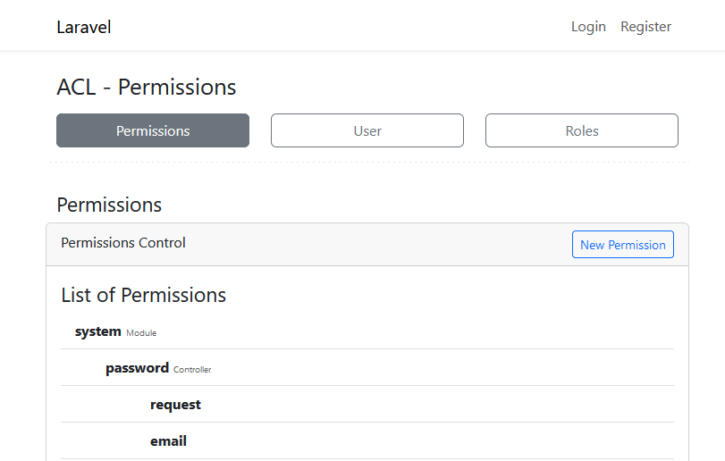

<p align="center"></p>


# ACL - Permisions

[](//packagist.org/packages/luizfabianonogueira/acl-permissions)
[](//packagist.org/packages/luizfabianonogueira/acl-permissions)
[](//packagist.org/packages/luizfabianonogueira/acl-permissions)
[](//packagist.org/packages/luizfabianonogueira/acl-permissions)

This package is a simple and easy way to manage permissions in Laravel applications.

## Installation

You can install the package via composer:

```bash
composer require luizfabianonogueira/acl-permissions
```

## Configuration

You can publish the config file with:
```bash
php artisan vendor:publish --tag="acl-permissions-config"
php artisan vendor:publish --tag="acl-permissions-migrations"
php artisan vendor:publish --tag="acl-permissions-views"
```

This is the contents of the published config file:

```php
return [

    /**
     * Define the column type of the id in user table.
     */
    'user_id_is' => 'UUID', # INTEGER or UUID

    /**
     * Define the column type of the id in user table.
     */
    'role_id_is' => 'UUID', # INTEGER or UUID

    /**
     * The user model that should be used to retrieve your permissions.
     */
    'user' => App\Models\User::class,

    /**
     * The role model that should be used to retrieve your permissions.
     */
    'role' => null
];

```
### Extension UUID is available in Laravel 8.x \  
### Verify if the UUID is enabled in your database.

After publishing the config file and the migrations, run the migrations:

```bash
php artisan migrate
```

In your `User` model add the code below:
```php
use LuizFabianoNogueira\AclPermissions\Models\Role;

    /**
     * Get the roles for the user.
     */
    public function roles(): BelongsToMany
    {
        return $this->belongsToMany(Role::class, 'role_user', 'user_id', 'role_id');
    }
```

In AppServiceProvider.php add the code below:
```php
use LuizFabianoNogueira\AclPermissions\Services\AclPermissionService;

    /**
     * Bootstrap any application services.
     */
    public function boot(): void
    {
        AclPermissionService::registerGates();
    }
```


In Bootstrap/app.php add the code below:
```php
use LuizFabianoNogueira\AclPermissions\Http\Middleware\ACLPermissions;

return Application::configure(basePath: dirname(__DIR__))
    ->withRouting(
        web: __DIR__.'/../routes/web.php',
        commands: __DIR__.'/../routes/console.php',
        health: '/up',
    )
    ->withMiddleware(function (Middleware $middleware) {
        $middleware->alias([
            'acl-permissions' => ACLPermissions::class
        ]);
    })
    ->withExceptions(function (Exceptions $exceptions) {
        //
    })->create();
```

In app/Http/Controllers/Auth/LoginController.php add the code below:
```php
use LuizFabianoNogueira\AclPermissions\Services\AclPermissionService;

    /**
     * @return string
     */
    public function redirectTo(): string
    {
        AclPermissionService::loadPermissions();
        return $this->redirectTo;
    }
```


## Usage

To access the permissions screen, access the url below:
```
https://[urlofyoursystem]/acl-permissions/permissions/list
```


### Permissions
On this screen, you can create, edit, and delete permissions.
Permissions are used to control access to the application's routes.
There are two ways to use permissions: \
- URL, which is done through middleware comparing the route name with the permission name. In this case, you should pay attention to the route name structure. \
- Gates or the user interface. @can

### Users
On the users screen you can just link the roles.

### Roles
On the roles screen you can create, edit and delete roles.
Then you can add permissions to roles.
Roles are used to control access to application routes.


### License: LGPL-3.0-or-later

___
___

## Contact & Support

[](https://www.linkedin.com/in/luiz-fabiano-nogueira-b20875170/)
[](https://api.whatsapp.com/send?phone=5548991779088)
[](https://github.com/LuizFabianoNogueira)
[](https://packagist.org/packages/luizfabianonogueira/)

📞 **Phone:** [+5548991779088](tel:+5548991779088)  
✉️ **Email:** [luizfabianonogueira@gmail.com](mailto:luizfabianonogueira@gmail.com)

---

### Support My Work

If you enjoyed this project and would like to support my work, any donation via Pix is greatly appreciated!  
Feel free to donate using one of the following Pix keys:

💳 **Email Pix Key:** `luizfabianonogueira@gmail.com`  
📱 **Phone Pix Key:** `48991779088`

Thank you for your support!
